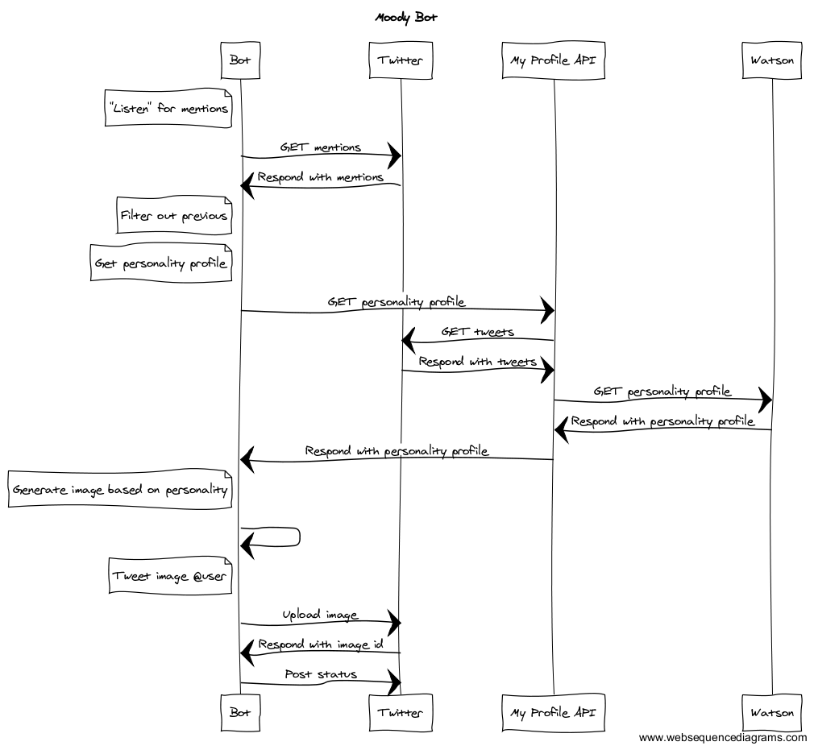

# Moody Bot

When you tweet at Moody Bot, it studies your posts, analyzes your personality, and then draws a picture for you.

Moody Bot uses [IBM's Watson](http://www.ibm.com/smarterplanet/us/en/ibmwatson/). This analysis provides the seed for generating a unique image, which is then posted to Moody Bot's Twitter feed.

The bot is a Node.js script that is scheduled to check for new mentions on a regular interval. The code that generates the image is inspired by the [superformula](http://www.amjbot.org/content/90/3/333.abstract).

Moody Bot is just getting going. Check out [the Twitter page](https://twitter.com/MoodyMeeks) to see what it's been up to.

## Architecture
This is how the various pieces fit together.

